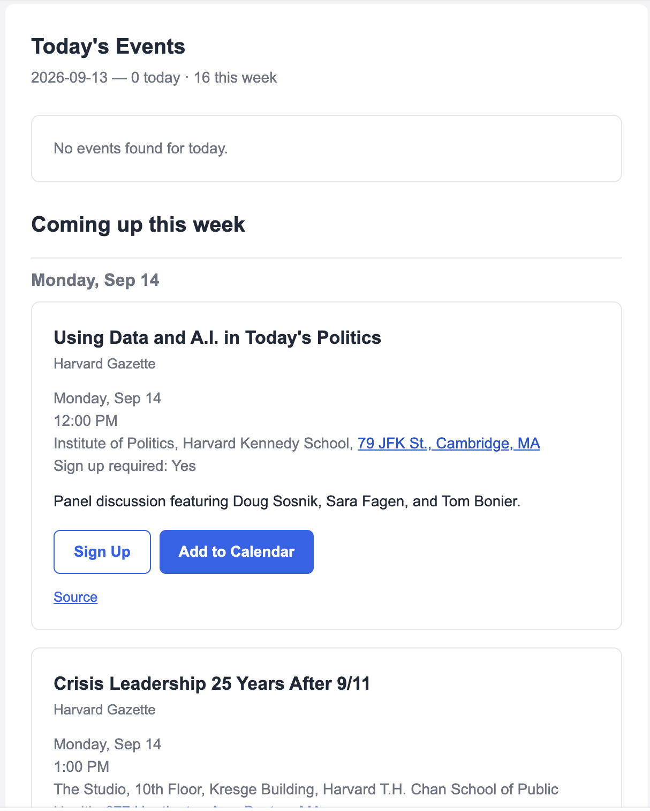

# irl-events-daily

Claude Code Routine that scrapes the event calendars for a set of organizations/groups that you define and sends a daily email of upcoming events. 

### Background

I got tired of tracking multiple event calendar web pages for organizations I'm interested in. I created this Claude Code Routine to scrape the upcoming events across each of the organization's web pages, and send me a daily email with upcoming events, with an easy 'Add to Calendar' link. 

### Set up

1. Clone the repo locally
2. Open Claude Code, and run "/setup-irl-events-daily" to invoke the set up Skill
3. Go through the steps to add the organization/group event calendars that you want to track (eg "Boston AI Tinkerers at https://boston.aitinkerers.org/")
4. The `setup-irl-events-daily` Skill will set up a Claude Code Routine that sends a daily events digest 

